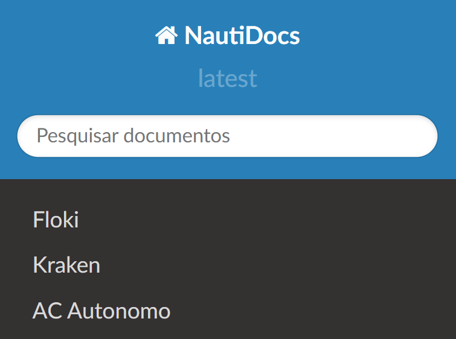

Bem vindo ao NautiDocs
===================================

**Poli Náutico** é uma equipe de nautidesign fundada em 2014 com o intuito de complementar a aprendizagem dos alunos.

Aqui documentamos nossos projetos para que vocês do futuro possam entender o que a gente fez :)

Como navegar pela documentação dos projetos
------

Na barra ao lado existem os projetos que já documentamos. Clique em um deles para ir às suas respectivas documentações.

.. note::
   O NautiDocs está em fase de construção!
   Todos estâo convidados a contribuir e corrigir erros. Caso nâo seja da equipe ou não esteja no time do nosso github, faça um pull request para sugerir edições

Contents
--------

.. toctree::
   :hidden:

   Floki <https://docs.polinautico.com/projects/Floki/>
   Kraken <https://docs.polinautico.com/projects/Kraken/>
   AC Autonomo <https://docs.polinautico.com/projects/AC-Autonomo/>
   editar
