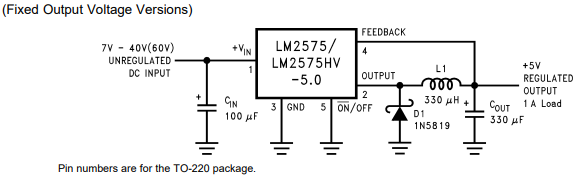

=====
Reguladores de Tensão
=====

Ahoy, maraujos!
Este é um post para explicar de maneira simplificada sobre reguladores de tensão e o processo de fabricação de nossos reguladores personalizados.

O que são Reguladores de Tensão?
============

Reguladores de tensão são dispositivos que produzem uma tensão de saída estabilizada, utilizando componentes eletrônicos para tal. Podemos separá-los em 3 categorias:

-  Circuitos que apenas abaixam a tensão de entrada, chamados step-down ou buck;
-  Circuitos que apenas elevam a tensão de entrada, chamados step-up ou boost;
-  Circuitos que conseguem tanto abaixar quanto elevar a tensão de entrada, chamados de buck-boost;

Reguladores Lineares
============

Necessitando apenas de um capacitor, os reguladores lineares utilizam um transistor como um resistor variável, dissipando a energia excedente. Por isso, é o tipo menos eficiente de regulador. Outra desvantagem sua é ser apenas do tipo buck. Mas seu circuito simples e baixo ruído eletromagnético compensam em aplicações específicas.

Reguladores Chaveados
============

Este tipo de circuito já é mais complexo, necessitando de alguns componentes externos, como indutores, capacitores e diodos, para seu correto funcionamento. A grande vantagem deste tipo de circuito é sua alta eficiência, acima de 80% na maioria dos casos.

Reguladores chaveados funcionam conectando e desconectando a saída rapidamente. Quando ligado, um capacitor na saída carrega e aumenta sua tensão, e quando desligado, o capacitor fornece energia para a carga. Sendo assim, a tensão de saída sofre com uma pequena oscilação denominada ripple.

Nossa escolha
============

No caso do Poli Náutico, onde em geral trabalhamos com baterias de 12 V, optamos por desenvolver circuitos chaveados buck para 5 V. Para o caso especial de nosso barco solar, que possui um banco de baterias de 48 V, desenvolvemos um circuito chaveado buck para 12 V.

Regulador 5 V
============

Para fornecer os 5 V necessários para os microcontroladores que usamos, optamos pelo circuito integrado (CI) LM2575, que possui uma corrente máxima de 1 A e tensão máxima de entrada de 40 V.

Regulador 12 V
============

Para fornecer 12 V aos componentes do Floki, nosso barco solar, utilizamos o CI LM2576HV, capaz de fornecer até 3 A de corrente e aceita até 60 V em sua entrada. A versão normal do CI não serviria nossos propósitos visto que aceita apenas 40 V de entrada, e o banco de baterias do barco é de 48 V.

Regulador Ajustável
============

O circuito do regulador ajustável decidimos comprar feito, a partir do CI LM2596, que também é capaz de fornecer 3 A de corrente e tensão de saída variável entre 1,2 V e Vin - 3 V. Optamos por não fabricar este circuito pois o preço das peças era maior que a placa pronta, e não temos tantos usos para tensões diferentes do padrão 5 V.

O Circuito
============

Escolhemos variantes de um mesmo circuito integrado para este projeto, assim o circuito externo possui os mesmos componentes, mudando apenas seus valores.

De acordo com o datasheet, precisamos de um capacitor de entrada e um de saída, um indutor e um diodo. Os valores desses componentes dependem da tensão esperada de entrada e da corrente prevista de saída, informados em gráficos nos respectivos datasheets.

Capacitor de entrada
--------------

Para uma operação estável, é necessário um capacitor de pelo menos 47 μF de tensão acima do esperado. A fim de utilizar um único capacitor para ambos os circuitos, decidimos por capacitores eletrolíticos de 100 μF, 63 V.

Capacitor de saída
--------------

Na saída, é necessário um capacitor para reduzir o nível de oscilações (ripple). De acordo com o datasheet, quanto maior o valor do componente, menor a oscilação. Como nossa aplicação não é sensível ao ripple, um capacitor eletrolítico de 470 μF, 25 V é o suficiente.

Indutor
--------------

Para a escolha do indutor, consideramos o pior caso possível para os circuitos, que seria corrente máxima e tensão de entrada acima do ideal (1 A e 15 V para o LM2575, 3 A e 60 V para o LM2576). Incrivelmente, para ambos os casos um indutor de 220 μH é o suficiente.

Diodo
--------------

Segundo o datasheet, diodos das famílias 1N4000 e 1N5000 não são adequados por serem de baixa frequência. Também é sugerido 25% como margem de segurança nos valores de tensão.

A loja online que compramos os componentes não possuía uma grande variedade de diodos, então escolhemos o UF5408, que possui boa resposta em altas frequências e tensão reversa máxima de 1000 V. Apesar de ser muito além do necessário, era o único disponível na loja que atendia a demanda do circuito.

Resumo dos Componentes
============

.. list-table:: Componentes
    :widths: 25 25 50
    :header-rows: 1

   * - Heading row 1, column 1
     - Heading row 1, column 2
     - Heading row 1, column 3
   * - Row 1, column 1
     -
     - Row 1, column 3
   * - Row 2, column 1
     - Row 2, column 2
     - Row 2, column 3

